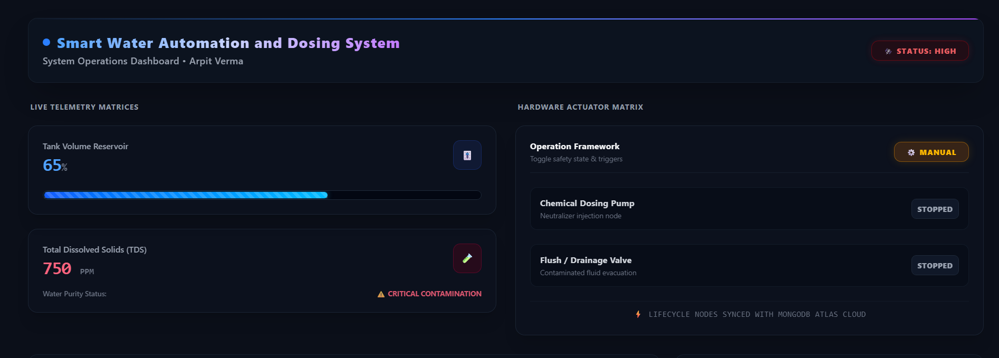
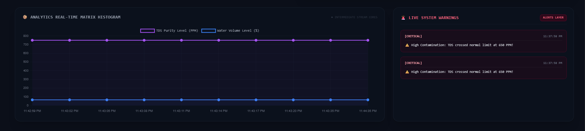

# 💧 Automatic Water Monitoring & Dosing Dashboard

A smart IoT dashboard designed to monitor and control water quality parameters such as **water level, turbidity, and pH** in real-time.

This dashboard is part of the **Automatic Water Monitoring & Chemical Dosing System** project aimed at improving water quality monitoring using IoT and intelligent automation.

---

## 🚀 Features

* Real-time water quality monitoring
* Animated gauge visualization
* Sensor data graph using Chart.js
* Manual dosing control
* Alert system for abnormal conditions
* Dark mode support
* Hardware-ready architecture for IoT integration

---

## 📊 Sensors Monitored

* Water Tank Level
* Turbidity
* pH Level

---

## ⚙️ Technologies Used

* HTML5
* CSS3
* JavaScript
* Chart.js

---

## 🔌 Future IoT Integration

This dashboard is designed to integrate with:

* ESP32 / Arduino
* Ultrasonic Water Level Sensor
* Turbidity Sensor
* pH Sensor
* Relay-controlled dosing pump

Data can be connected through:

* Firebase
* REST API
* MQTT

---

## 📷 Dashboard Preview

---

## 👨‍💻 Developed By

Arpit Verma

LinkedIn:
https://www.linkedin.com/in/arpit-verma-687b3b332/

---

## 📜 Project Goal

To build an **intelligent automated water monitoring and dosing system** that ensures safe and optimized water quality using IoT and smart automation.
